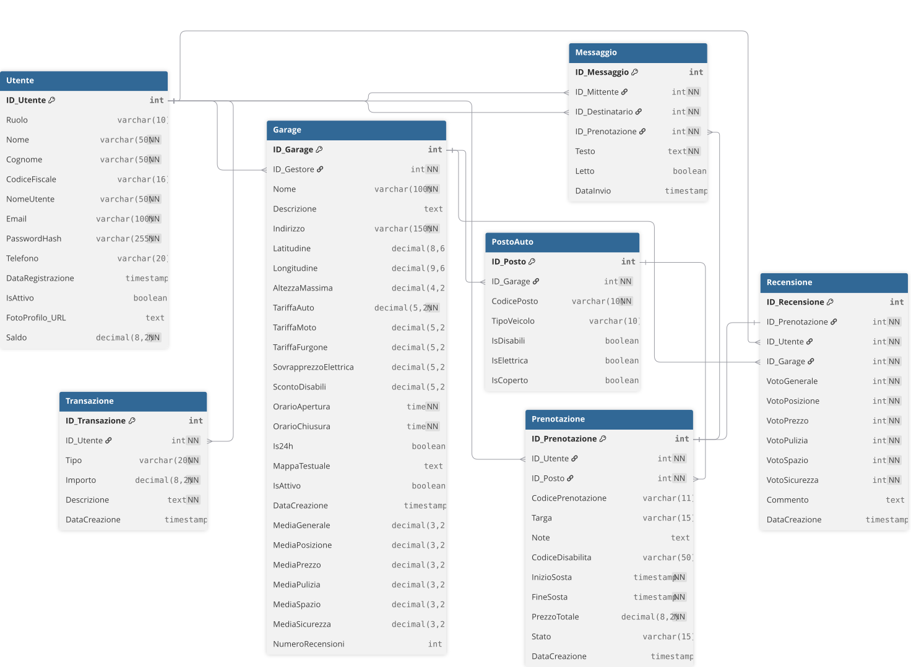

<h1 align="center">
  
</h1>

<p align="center">
  
  
  
  
  
  
  
  
  
  
</p>

Parkly è un'applicazione web full-stack per la gestione e la prenotazione di parcheggi, un progetto nato durante il corso di _Tecnologie e Sistemi Web_, all'Università degli Studi di Roma "La Sapienza".

## Indice

- [Architettura e tecnologie utilizzate](#architettura-e-tecnologie-utilizzate)
- [Struttura del progetto](#struttura-del-progetto)
- [Schema del database](#schema-del-database)
- [Funzionalità](#funzionalità)
  - [Pubblicazione di un garage](#pubblicazione-di-un-garage)
  - [Chat interattiva](#chat-interattiva)
  - [Ricerca dei garage](#ricerca-dei-garage)
  - [Flusso di prenotazione](#flusso-di-prenotazione)
  - [Gestione del saldo](#gestione-del-saldo)
  - [Sistema di recensioni](#sistema-di-recensioni)
- [Viste](#viste)
- [Installazione](#installazione)
- [Autori](#autori)

## Architettura e tecnologie utilizzate

Il progetto segue un'architettura client-server. Il frontend è una single-page application costruita con Vue.js e Vite, comunica con il backend tramite API REST esposte da un server Express. I dati sono affidati ad un'istanza di PostgreSQL. L'autenticazione è gestita tramite sessioni server-side con `express-session`: al login i dati dell'utente vengono scritti in una sessione e il browser conserva esclusivamente il cookie. Ad ogni richiesta protetta, il middleware verifica la presenza e la validità della sessione prima di procedere.

## Struttura del progetto
```
parkly/
├── client/
│   └── src/
│       ├── assets/          # Icone SVG e immagini statiche
│       ├── components/      # Componenti UI riutilizzabili
│       ├── composables/     # Logica reattiva incapsulata
│       ├── router/          # Routing lato client
│       ├── store/           # Stato applicativo
│       ├── utils/           # Funzioni ausiliarie
│       └── views/           # Componenti a livello di pagina
└── server/
    ├── database/
    │   ├── parkly.sql       # Definizione dello schema
    │   └── seed.sql         # Dati di esempio
    ├── middleware/
    │   └── authMiddleware.js
    ├── routes/              # Endpoint REST
    └── index.js
```

## Schema del database

Il database è composto da sette tabelle. `Utente` è l'entità centrale: un utente con ruolo `GESTORE` può possedere uno o più `Garage`, ciascuno composto da più `PostoAuto`. Una `Prenotazione` associa un utente a un posto per un intervallo temporale definito e costituisce il presupposto per le entità dipendenti: `Messaggio`, `Recensione` e `Transazione`. Di seguito il diagramma E-R:

<p align="center">
  
</p>

## Funzionalità

- Prenotazione di posti auto con selezione dell'intervallo orario e addebito automatico sul portafoglio.
- Ricerca garage per posizione geografica su mappa interattiva e lista, con filtri per tipo di veicolo, accesso disabili, ricarica elettrica e copertura.
- Portafoglio integrato con ricarica manuale e storico completo delle transazioni.
- Chat in tempo reale tra cliente e gestore, contestualizzata alle prenotazioni attive.
- Sistema di recensioni vincolate alle prenotazioni concluse.
- Dashboard gestore con occupazione in tempo reale, statistiche mensili e planimetria interattiva del garage.

### Pubblicazione di un garage

La creazione di un garage è uno dei flussi più interessanti dell'applicazione e si articola in tre fasi sequenziali, gestite interamente nella dashboard del gestore.

La prima fase riguarda la posizione. Il gestore compila un form e il sistema invoca un'API di geocodifica per calcolare le coordinate e centrare la mappa sul risultato. Le coordinate sono poi affinabili con un click diretto sulla mappa per migliorare la precisione e prevenire errori del server. 

La seconda fase è la configurazione dei posti. Per ogni posto il gestore specifica un codice alfanumerico, il tipo di veicolo (il sistema supporta AUTO, MOTO, FURGONE) e i flag booleani per posti dotati di ricarica elettrica, accessibilità per persone con disabilità e copertura. Il codice può essere lasciato vuoto, in questo caso sarà il sistema a generarlo automaticamente in base al tipo.

La terza fase è il disegno della planimetria. Dopo aver "creato" i posti del garage, una griglia CSS a dimensioni configurabili rappresenta lo spazio fisico da riempire. Il gestore seleziona un posto dal menù degli strumenti e lo posiziona sulla griglia, disegnando la planimetria desiderata. In particolare ogni posto occupa un'area proporzionale al tipo di veicolo (MOTO: 1x1, AUTO: 2x1, FURGONE: 2x2). Man mano che la griglia viene riempita, il componente `PlanimetriaGarage` renderizza l'anteprima in tempo reale, effettuando il parsing di una stringa testuale. Questa stringa, che descrive il layout disegnato dall'utente, viene infine salvata nel campo `MappaTestuale` del database e utilizzata dal client per visualizzare la piantina definitiva.

### Chat interattiva

todo

### Ricerca dei garage

todo

### Flusso di prenotazione

todo

### Gestione del saldo

todo

### Sistema di recensioni

todo

## Viste

| Rotta | Componente | Descrizione |
|---|---|---|
| `/` | `HomeView` | Pagina principale dell'applicazione |
| `/garage` | `GarageView` | Lista garage con mappa interattiva e filtri |
| `/garage/:id` | `GarageDetailView` | Dettaglio garage, disponibilità e prenotazione |
| `/prenotazioni` | `BookingsView` | Storico e prenotazioni attive dell'utente |
| `/portafoglio` | `WalletView` | Gestione saldo e storico transazioni |
| `/dashboard-gestore` | `GestoreDashboardView` | Statistiche e amministrazione garage (gestore) |
| `/profile` | `ProfileView` | Impostazioni account ed eliminazione |
| `/register` | `RegisterView` | Registrazione sulla piattaforma |
| `/diventa-gestore` | `BecomeGestoreView` | Richiesta ruolo gestore |

## Installazione

### Prerequisiti

Node.js e un'istanza PostgreSQL, locale o remota.

### Installazione delle dipendenze

```bash
git clone https://github.com/chitvs/parkly.git
cd parkly

cd server && npm install
cd ../client && npm install
```

### Configurazione del database

Dopo aver creato l'istanza del database (locale o remota), creare le tabelle con il codice in `parkly.sql` e popolarle con `seed.sql` per avere dei dati di prova.

### Variabili d'ambiente

Creare un file `.env` in `server/` con le seguenti variabili:

```env
DB_USER
DB_PASSWORD
DB_HOST
DB_PORT
DB_NAME
SESSION_SECRET
PORT
SUPABASE_URL
SUPABASE_SERVICE_KEY
```

### Avvio

```bash
npm run dev
```

Il client sarà disponibile su `http://localhost:5173`, il server su `http://localhost:3000`. Per testare il server collegarsi a:

`localhost:3000/test-db`

Se il server risponde con successo, l'applicazione è connessa correttamente.

## Autori

Sviluppato da Andrea Carbone, Alessandro Chitarrini, Matteo Crugliano e Davide Gaglione.
